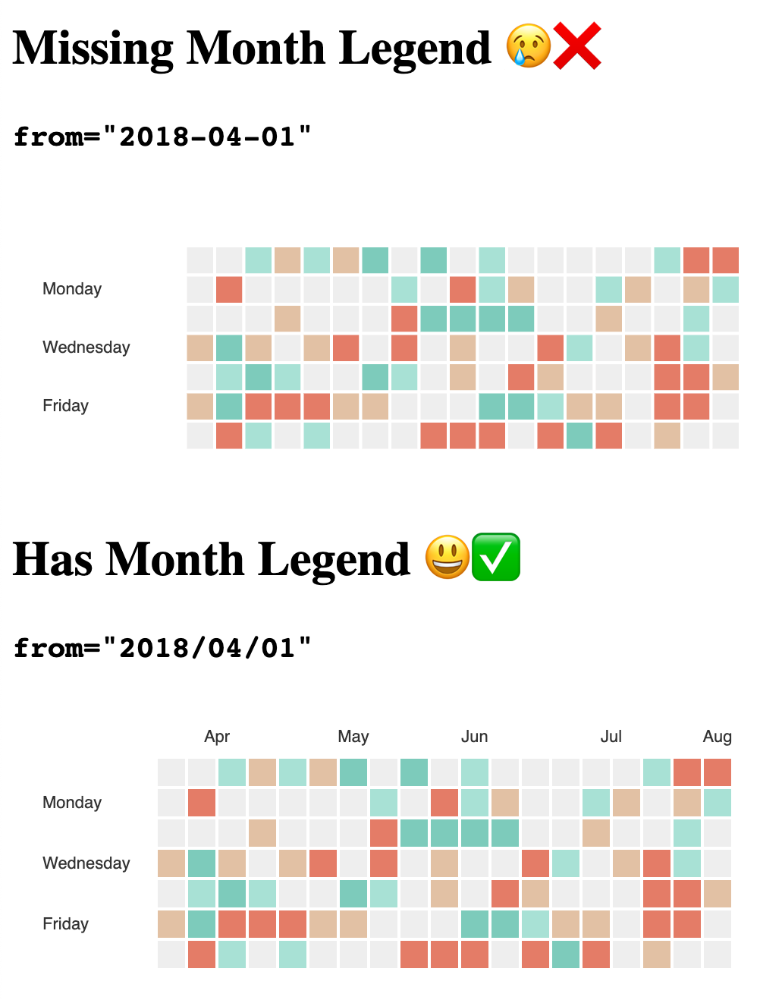

# Nivo Time Range Month Legend Behavior

This app demonstrates unexpected month legend behavior on the Nivo Time Range.

## Findings

Although this behavior is not described in the TimeRange documentation, I've found two factors that determine wether the month legend renders:

- Number of days in first column
  - If number of days in first column is 7, month legend does not render
- Setting `from` prop
  - Setting month or day to one digit (e.g. `from="2018-4-01"`) causes month to render
  - Note: Using a `Date` instance does not seem to have an effect

## Workaround

One way I have found to ensure the month legend renders is by setting the `from` prop to a date delineated by /'s instead of -'s.

## Running Locally

- Ensure you have Node.js installed
- Run `npm i` and `npm run dev` at the root
- Open http://localhost:3000/ in your browser
